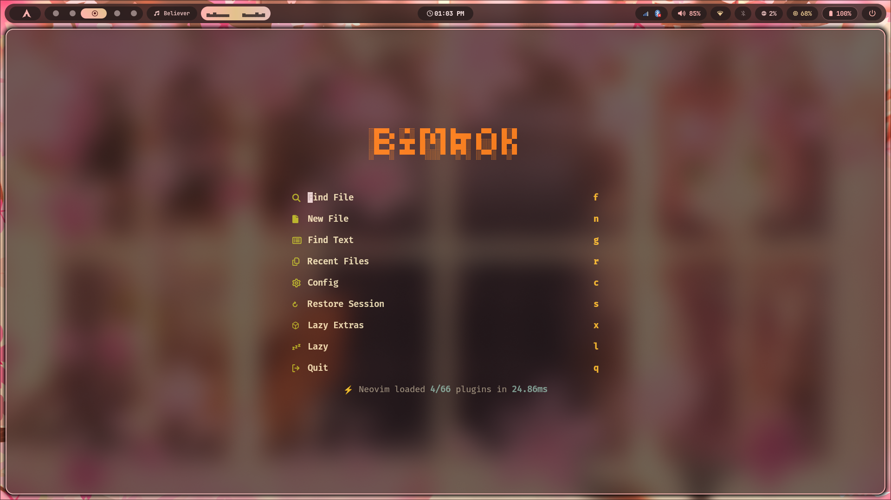
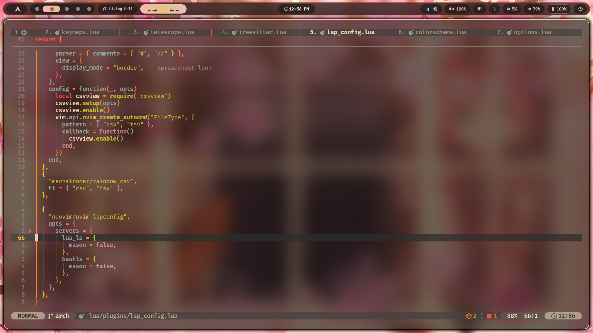

# Sunset LazyVim NVIM

An aggressively optimized [LazyVim](https://github.com/LazyVim/LazyVim) setup built for speed, a polished transparent Gruvbox UI, and a loaded developer workflow without turning the config into a mess.

Current startup shown in the latest dashboard screenshot: `24.86ms` with only `4/66` plugins loaded at launch.

This is no longer a basic LazyVim fork. It is a faster, cleaner, better-layered setup with a custom UI, stronger lazy-loading, richer tooling, and a much more complete editing experience.

<p align="center">
  
  
</p>


## Why This Config Hits Hard

This config keeps LazyVim as the foundation and extends it with:

- a transparent `gruvbox` theme with custom highlight overrides
- polished UI components through `lualine`, `bufferline`, `noice`, `snacks`, and `neoscroll`
- `telescope` and `yazi` for fast file and project navigation
- `blink.cmp` completion and LazyVim LSP extras for TypeScript, JSON, Python, Go, Java, and Clangd
- Treesitter-based highlighting plus context, rainbow delimiters, markdown rendering, CSV viewing, and inline image support
- floating terminal workflows through `toggleterm`, including custom file-run and git helper commands

What that means in practice:

- boots in about `24ms` instead of feeling like a full IDE
- loads only what is needed at startup and defers the rest
- keeps the UI sharp without dragging the editor down
- covers coding, writing, git work, markdown, CSV, media, and terminal workflows in one setup
- stays modular enough to keep extending without turning maintenance into pain

## Feature Set

### UI and workflow

- `24.86ms` startup in the current dashboard capture
- only `4/66` plugins loaded on startup in the current dashboard capture
- Transparent Gruvbox with custom floating-window, dashboard, completion, and bufferline styling
- Snacks dashboard with a custom `BIMBOK` header
- Rounded floating windows across Noice, completion docs, hover, and terminal popups
- Bufferline, lualine, git blame, marks, flash navigation, reach buffer switching, and undo tree access
- Smooth scrolling with `neoscroll`
- Cursor motion effects with `smear-cursor.nvim`
- Stronger movement discipline with `hardtime.nvim`
- Better visual structure with Snacks indent guides and Treesitter context
- Auto-save enabled on common editing events

### Editing and language support

- `blink.cmp` with rounded menus, ghost text, auto brackets, and signature help
- LSP support layered on top of LazyVim with extras for TypeScript, JSON, Python, Go, Java, and Clangd
- Manual formatting through `conform.nvim`
- Tailwind, CSS, and color previews with `nvim-colorizer.lua`
- Color picking with `ccc.nvim`
- Treesitter parsers preconfigured for Lua, C, C++, ASM, HTML, JavaScript, TypeScript, TSX, Python, Java, JSON, Markdown, YAML, XML, and more
- Conform formatters for Lua, C/C++, Python, shell, JavaScript, TypeScript, JSON, CSS, HTML, and Markdown
- Rendered Markdown, math support for Markdown/Org, CSV spreadsheet-style viewing, and rainbow CSV colors
- Snippet support through the local `snippets/` directory

### Terminal and tooling

- Floating terminal on `<C-\\>` or `<leader>'`
- Run-current-file command on `<leader>cL` for `c`, `cpp`, `py`, `js`, `java`, `sh`, `go`, `asm`, and `rs`
- Yazi file manager integration inside Neovim
- Clipboard image pasting with `img-clip.nvim`
- `image.nvim` configured for the Kitty backend
- Discord presence through `cord.nvim`
- Git graph visualization with `gitgraph.nvim`
- Custom floating `bimagic` launcher for git workflow
- Built-in session recovery entry on the dashboard through Snacks and LazyVim session support

## Plugin Structure

The config is split into small modules instead of one large file:

```text
init.lua
lua/config/
lua/plugins/
```

Main entry points:

- `lua/config/lazy.lua`: Lazy.nvim bootstrap and LazyVim imports
- `lua/config/options.lua`: editor options
- `lua/config/keymaps.lua`: custom keymaps and run-current-file workflow
- `lua/config/autocmds.lua`: custom autocommands
- `lua/plugins/*.lua`: plugin overrides and additional plugins

## Enabled Imports and Extras

Configured through `lua/config/lazy.lua` and `lazyvim.json`:

- LazyVim extras for Copilot, Clangd, Go, Java, and DOT utilities
- LazyVim imports for TypeScript, JSON, Python, Prettier, and ESLint

## Optimization Notes

This setup is tuned to stay fast without stripping away useful features:

- plugin loading is pushed onto `VeryLazy`, `LazyFile`, filetype, command, and key-triggered events where possible
- only a minimal slice of the plugin set is loaded on startup
- several built-in runtime plugins are disabled in `lua/config/lazy.lua`
- UI polish is kept, but expensive features are still mostly lazy-loaded
- the config stays split across focused modules so optimization work remains maintainable

## Requirements

Required:

- Neovim `0.10+`
- `git`
- a Nerd Font
- `ripgrep`

Recommended for the full experience:

- `fd` for file searching
- `gcc` or `clang`
- `make` for native Telescope FZF builds
- `yazi`
- `kitty` if you want inline image rendering through `image.nvim`
- `wl-clipboard`, `xclip`, or an equivalent clipboard tool for image paste workflows
- language tools such as `node`, `python3`, `go`, `rustc`, `nasm`, `java`, `clang-format`, `black`, `isort`, `prettier`, and `shfmt` if you use the related mappings and formatters

## Installation

```bash
mv ~/.config/nvim ~/.config/nvim.bak
git clone https://github.com/Bimbok/nvim ~/.config/nvim
nvim
```

On first launch, `lazy.nvim` installs the plugin set automatically.

## Key Mappings

Common custom mappings in this config:

| Key          | Action                            |
| ------------ | --------------------------------- |
| `<leader>ff` | Find files                        |
| `<leader>fg` | Live grep                         |
| `<leader>fb` | List open buffers                 |
| `<leader>fr` | Recent files                      |
| `<leader>fh` | Help tags                         |
| `<leader>-`  | Open Yazi in current file context |
| `<leader>cw` | Open Yazi in working directory    |
| `<C-\\>`     | Toggle floating terminal          |
| `<leader>'`  | Open floating terminal            |
| `<leader>cL` | Run current file                  |
| `<leader>jf` | Format current buffer             |
| `<leader>ip` | Paste image from clipboard        |
| `<leader>mt` | Toggle rendered Markdown          |
| `<leader>gl` | Open git graph                    |
| `<leader>gm` | Open Bimagic git helper           |
| `<leader>rb` | Reach open buffers                |
| `<leader>rm` | Reach marks                       |
| `<leader>uu` | Toggle UndoTree                   |
| `<leader>cx` | Toggle Treesitter context         |

## Notes

- Transparency is handled by your terminal or compositor, not by Neovim alone.
- `image.nvim` is configured with the Kitty backend, so inline image rendering works best in Kitty.
- The config disables some built-in runtime plugins for a leaner startup path.
- `package.json` writes currently trigger `npm install` through an autocmd.

## License

This repository currently ships with the Apache 2.0 license. See [LICENSE](./LICENSE).
